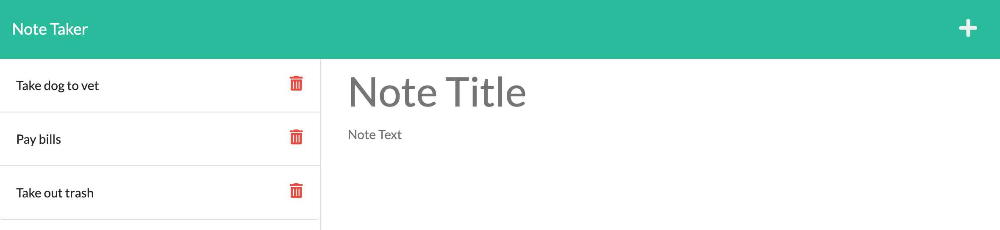

# note-taker

## User Story
AS A small business owner

I WANT to be able to write and save notes

SO THAT I can organize my thoughts and keep track of tasks I need to complete

## Description
A user is displayed with the landing page. Once they click the button they are taken to the notes page. From here they can enter a note and a brief description and save to the notes list. The saved notes can then be displayed by clicking them.

## What Was Used
express.js

uuid npm package

## Preview

## GitHub Repo
https://github.com/randronaco1027/note-taker 

## Heroku
https://guarded-shelf-55133.herokuapp.com/ 